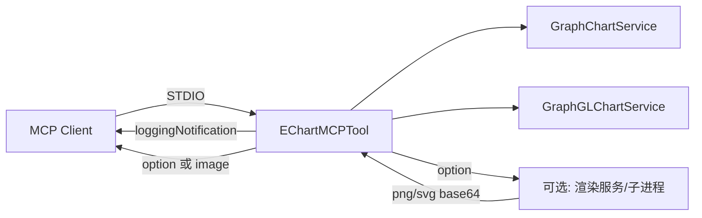

# ECharts MCP Server 系统架构设计

## 1. 系统设计

ECharts MCP Server 是一个基于 MCP 的 Java 服务，通过 STDIO 与 MCP 客户端通信，对外仅提供**关系图（graph）**与 **GL 关系图（graphGL）**两种图表生成工具。大模型或前端调用工具时传入节点/边数据与 **outputType**（option / png / svg），服务端可返回 ECharts option JSON，或通过**服务端渲染**返回 PNG/SVG 图像，便于直接嵌入大模型返回或前端用 `` 展示，降低前端开发量。

### 1.1 职责

- 作为 **MCP 服务端**：接收 MCP 客户端的工具调用（generate_graph_chart、generate_graph_gl_chart）。
- **构建 ECharts option**：根据传入的 nodes/edges 与布局等参数，生成符合 ECharts/ECharts GL 规范的 JSON。
- **可选：服务端渲染**：当 outputType 为 png 或 svg 时，将 option 渲染为图像并返回（base64 或 MCP image content），使返回可直接嵌入 LLM 回复或前端无需 ECharts 即可展示。
- **日志通知**：在工具执行各阶段通过 MCP `loggingNotification` 发送 INFO/ERROR，便于客户端展示“调用中/成功/失败”。

### 1.2 架构示意



---

## 2. 项目结构（目标状态）

精简后仅保留关系图与 GL 关系图相关代码：

```
mcp/server/echart/
├── pom.xml
└── src/main/
    ├── java/mcp/canary/echart/
    │   ├── EchartApplication.java      # Spring Boot 入口
    │   ├── model/
    │   │   ├── GraphData.java          # 图数据：nodes + edges
    │   │   ├── GraphNode.java          # 节点：id, name, value?, category?
    │   │   └── GraphEdge.java          # 边：source, target, value?
    │   ├── service/
    │   │   ├── GraphChartService.java   # 关系图 option 构建
    │   │   └── GraphGLChartService.java # GL 关系图 option 构建（待新增）
    │   └── tool/
    │       └── EChartMCPTool.java       # 仅保留 generate_graph_chart、generate_graph_gl_chart
    └── resources/
        └── application.yml
```

**待移除**：BarChartService、LineChartService、PieChartService，以及 EChartMCPTool 中的 generateBarChart、generateLineChart、generatePieChart；若 DataItem 仅被上述图表使用可一并删除。

---

## 3. 依赖

| 依赖 | 说明 |
|------|------|
| 父模块 `mcp/server` | Spring Boot 3.x、spring-ai-starter-mcp-server-webmvc、spring-boot-starter-web、lombok 等 |
| Jackson（通常由 Spring Boot 带入） | 用于构建 ObjectNode/ArrayNode 及 JSON 序列化 |
| io.modelcontextprotocol / MCP 相关 | 由 spring-ai-starter-mcp-server-webmvc 传递 |

- **outputType = option**：仅需 Jackson 构建 JSON，无需额外运行时。
- **outputType = png / svg**：需**服务端渲染**。Java 无 ECharts 运行时，可选方案：（1）内嵌/调用 **Node 子进程**（复用 example 的 ECharts + canvas 渲染逻辑）；（2）独立 **Node 渲染服务**（HTTP 接收 option，返回 PNG/SVG），ECharts MCP 或 Next.js 调用该服务；（3）Java 侧仅支持 option，由 Next.js API Route 在调用 MCP 拿到 option 后，再调渲染服务得到图像并返回前端。在架构中明确一种即可。

---

## 4. MCP Tool 输入输出规范与通知逻辑

### 4.1 统一输入结构（两个工具共用）

| 参数名 | 类型 | 必填 | 说明 |
|--------|------|------|------|
| **title** | string | 否 | 图表标题 |
| **data** | object | 是 | 图数据，见下表 |
| **data.nodes** | array | 是 | 节点列表，至少 1 个。每项：`id`(string)、`name`(string)、`value`(number, 可选)、`category`(string, 可选) |
| **data.edges** | array | 否 | 边列表，默认 []。每项：`source`(string)、`target`(string)、`value`(number, 可选) |
| **layout** | string | 否 | 布局：`force` / `circular` / `none`，默认 `force` |
| **width** | number | 否 | 画布宽度（像素），渲染 png/svg 时有效，默认 800 |
| **height** | number | 否 | 画布高度（像素），默认 600 |
| **theme** | string | 否 | 主题：`default` / `dark`，默认 `default` |
| **outputType** | string | 否 | 输出类型：`option` / `png` / `svg`，默认 `option` |

**data 示例**：

```json
{
  "nodes": [
    { "id": "a", "name": "A", "category": "类型1" },
    { "id": "b", "name": "B", "value": 10 }
  ],
  "edges": [
    { "source": "a", "target": "b", "value": 1 }
  ]
}
```

### 4.2 统一输出规范

| outputType | MCP 返回格式 | 用途 |
|------------|--------------|------|
| **option** | `content: [{ type: "text", text: "<ECharts option JSON 字符串>" }]` | 前端用 ECharts + echarts-gl 渲染；或大模型将 JSON 嵌入回复 |
| **png** | `content: [{ type: "image", data: "<base64>", mimeType: "image/png" }]` 或 `type: "text", text: "data:image/png;base64,..."` | 可直接嵌入 LLM 回复（如 Markdown 图片）、前端用 `` 展示，**无需前端 ECharts** |
| **svg** | `content: [{ type: "text", text: "<SVG 字符串>" }]` 或 image 类型同 png | 同上，SVG 可缩放、体积小 |

当支持 png/svg 时，返回可直接被大模型或前端使用，降低前端开发量；前端也可不通过大模型，直接请求“图谱工具接口”（见 Next.js 文档）传入相同参数获取 option 或 image 并展示。

### 4.3 generate_graph_chart（关系图）

| 项目 | 说明 |
|------|------|
| **name** | `generate_graph_chart` |
| **description** | 生成关系图（网络图），用于显示实体（节点）之间的关系。支持 outputType：option（返回 ECharts option JSON）、png、svg（返回图像，便于嵌入或直接展示）。 |
| **输入** | 见 4.1 统一输入结构 |
| **输出** | 见 4.2 统一输出规范 |
| **通知逻辑** | 开始时：`INFO` "开始生成关系图: <title>"；处理中：`INFO` "正在处理关系图数据，节点数: N, 边数: N"；成功：`INFO` "关系图生成完成"；失败：`ERROR` "生成关系图失败: ..." |

**ECharts option**：`series[].type = "graph"`，支持 layout（force/circular/none）、force 参数（repulsion、gravity、edgeLength 等）、categories、label、lineStyle 等，与 example 中 graph.ts 对齐。

### 4.4 generate_graph_gl_chart（GL 关系图，待新增）

| 项目 | 说明 |
|------|------|
| **name** | `generate_graph_gl_chart` |
| **description** | 生成 GL 关系图（WebGL 3D/GPU 布局），适合较大规模节点边数据。支持 outputType：option、png、svg。 |
| **输入** | 与 generate_graph_chart 一致，见 4.1 |
| **输出** | 与 4.2 一致；option 中 `series[].type = "graphGL"` |
| **通知逻辑** | 与关系图一致：开始 / 处理中 / 完成 / 失败 的 INFO/ERROR 日志 |

**ECharts option**：`series[].type = "graphGL"`，数据结构仍为 `data`（节点）与 `links`（边）。当 outputType 为 png/svg 时，若服务端渲染使用 ECharts GL，需在渲染环境中引入 echarts-gl。

---

## 5. 通知发送逻辑（统一）

- **入口**：每个工具方法均接收 `McpSyncServerExchange exchange`。
- **发送时机**：工具开始执行、关键步骤（如“正在处理数据”）、成功结束、异常时。
- **实现**：`sendLog(exchange, LoggingLevel.INFO|ERROR, message)`，内部调用 `exchange.loggingNotification(LoggingMessageNotification.builder().level(...).logger("echart-tool").data(message).build())`。
- **logger 名称**：`echart-tool`，便于客户端按 logger 区分 ECharts 工具并展示状态。

---

## 6. 服务端渲染（outputType = png / svg）实现思路

为使返回**可直接嵌入大模型回复或前端用 img 展示**，建议支持 outputType 为 png 或 svg。Java 无 ECharts 运行时，可选方案：

| 方案 | 说明 |
|------|------|
| **A. Java 调用 Node 子进程** | Java 构建好 option 后，spawn Node 脚本（复用 example 的 ECharts + @napi-rs/canvas 渲染逻辑），传入 option 与 width/height/theme，脚本返回 base64 PNG/SVG 或写入临时文件；Java 将结果放入 MCP 响应。 |
| **B. 独立 Node 渲染服务** | 单独起一个 Node HTTP 服务（如 POST /render，body 为 option + outputType），返回 PNG/SVG 或 base64。ECharts MCP（Java）在 outputType 为 png/svg 时，将 option 请求该服务，把得到的图像放入 MCP 响应；或由 Next.js API Route 在拿到 option 后请求该服务，再返回给前端。 |
| **C. 仅 Java 返回 option，由 Next.js 负责渲染** | ECharts MCP 只支持 outputType=option；Next.js 提供单独接口（如 POST /api/tools/echart/render），接收 option + outputType，在 Node 侧用 ECharts 渲染成 PNG/SVG 再返回。大模型嵌入时可由 Next.js 在流式回复中调用该接口得到 image 再推送。 |

任选其一并在实现中统一；A 与 B 使“返回可直接嵌入”在 MCP 层完成，C 使前端/LLM 侧仍只需对接 Next.js。

---

## 7. 配置

当前无特殊业务配置；若需端口或日志级别，可在 `application.yml` 中按 Spring Boot 惯例配置。若采用服务端渲染方案 A，需配置 Node 可执行路径及脚本路径；若采用 B，需配置渲染服务 URL。服务以 MCP STDIO 模式运行，由 MCP 客户端（如 Next.js API Route）启动子进程并连接。
