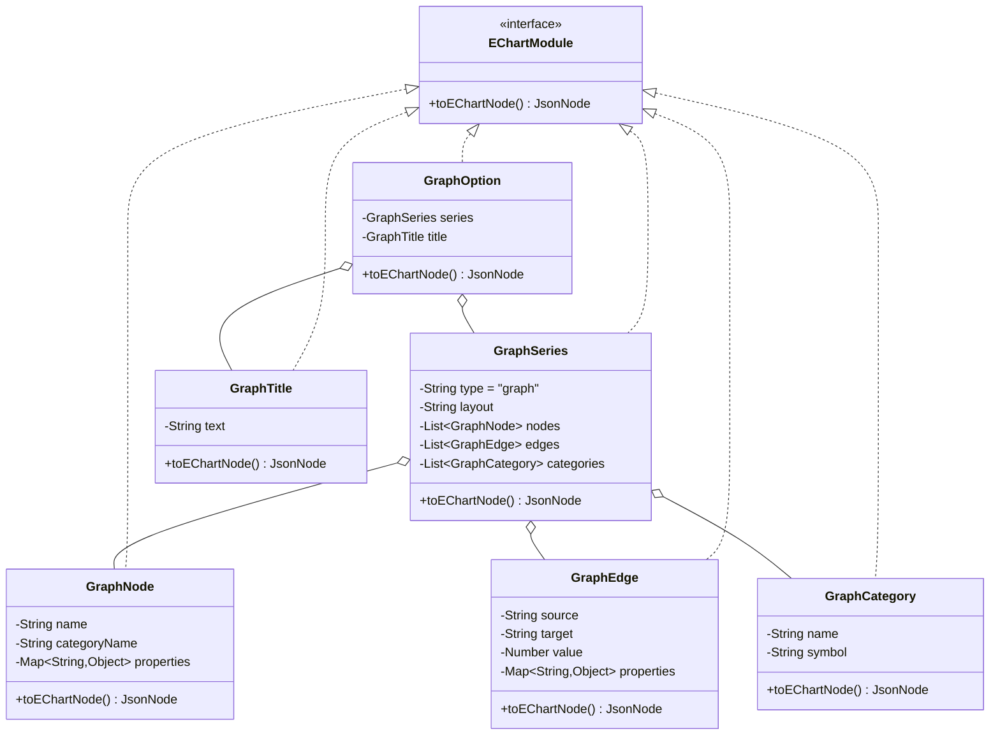

# ECharts module 类图

下面是 ECharts Graph option 数据模型的类图，展示模块化结构与组合关系。

```mermaid
classDiagram
    class EChartModule {
        <<interface>>
        +toEChartNode() JsonNode
    }

    class GraphOption {
        -GraphSeries series
        -GraphTitle title
        +toEChartNode() JsonNode
    }

    class GraphSeries {
        -String type = "graph"
        -String layout
        -List~GraphNode~ nodes
        -List~GraphEdge~ edges
        -List~GraphCategory~ categories
        +toEChartNode() JsonNode
    }

    class GraphNode {
        -String name
        -String categoryName
        -Map~String,Object~ properties
        +toEChartNode() JsonNode
    }

    class GraphEdge {
        -String source
        -String target
        -Number value
        -Map~String,Object~ properties
        +toEChartNode() JsonNode
    }

    class GraphCategory {
        -String name
        -String symbol
        +toEChartNode() JsonNode
    }

    class GraphTitle {
        -String text
        +toEChartNode() JsonNode
    }

    EChartModule <|.. GraphOption
    EChartModule <|.. GraphSeries
    EChartModule <|.. GraphNode
    EChartModule <|.. GraphEdge
    EChartModule <|.. GraphCategory
    EChartModule <|.. GraphTitle

    GraphOption o-- GraphSeries
    GraphOption o-- GraphTitle
    GraphSeries o-- GraphNode
    GraphSeries o-- GraphEdge
    GraphSeries o-- GraphCategory
```
