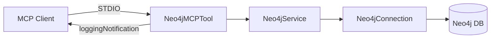

# Neo4j MCP Server 系统架构设计

## 1. 系统设计

Neo4j MCP Server 是一个基于 MCP（Model Context Protocol）的 Java 服务，通过 STDIO 与 MCP 客户端通信，对外暴露 Neo4j 图数据库的 schema 查询与 Cypher 读写能力，供大模型在对话中调用。

### 1.1 职责

- 作为 **MCP 服务端**：接收 MCP 客户端的工具调用请求（get-neo4j-schema、read-neo4j-cypher、write-neo4j-cypher）。
- **连接 Neo4j**：通过官方 Java Driver 执行 Cypher，区分读/写查询并返回结果或写入统计。
- **日志通知**：在工具执行各阶段通过 MCP `loggingNotification` 发送 INFO/ERROR，便于客户端展示“调用中/成功/失败”。

### 1.2 架构示意



---

## 2. 项目结构

```
mcp/server/neo4j/
├── pom.xml
└── src/main/
    ├── java/mcp/canary/neo4j/
    │   ├── Neo4jApplication.java      # Spring Boot 入口
    │   ├── db/
    │   │   └── Neo4jConnection.java    # Neo4j 驱动与连接管理
    │   ├── service/
    │   │   └── Neo4jService.java       # Cypher 执行与读/写判断
    │   └── tool/
    │       └── Neo4jMCPTool.java       # MCP 工具定义与日志发送
    └── resources/
        └── application.yml            # Neo4j 连接配置
```

- **Neo4jApplication**：Spring Boot 启动类。
- **Neo4jConnection**：封装 `neo4j-java-driver`，从配置读取 URI/用户名/密码/数据库名，提供 `createSession()`。
- **Neo4jService**：执行 Cypher、判断读/写（基于关键词 MERGE|CREATE|SET|DELETE|REMOVE|ADD），读查询返回记录列表，写查询返回计数器 Map。
- **Neo4jMCPTool**：使用 `@McpTool` 暴露三个工具，每个工具内通过 `sendLog(exchange, level, message)` 发送 MCP 日志通知。

---

## 3. 依赖

| 依赖 | 说明 |
|------|------|
| 父模块 `mcp/server` | Spring Boot 3.x、spring-ai-starter-mcp-server-webmvc、spring-boot-starter-web、lombok 等 |
| neo4j-java-driver | Neo4j 官方 Java 驱动，版本由父 POM 或属性 `${neo4j-java-driver.version}` 管理 |
| io.modelcontextprotocol / MCP 相关 | 由 spring-ai-starter-mcp-server-webmvc 传递，提供 `McpTool`、`McpSyncServerExchange`、`LoggingMessageNotification` 等 |

Neo4j 服务端需单独部署（如 Docker），本模块仅作为 MCP 服务器连接已有 Neo4j 实例。

---

## 4. MCP Tool 及输入输出与通知逻辑

### 4.1 get-neo4j-schema

| 项目 | 说明 |
|------|------|
| **name** | `get-neo4j-schema` |
| **description** | 列出 Neo4j 数据库中的所有节点类型、它们的属性以及它们与其他节点类型之间的关系 |
| **输入** | 无参数 |
| **输出** | `List<Map<String, Object>>`：每项为 `label`、`attributes`、`relationships` 等，对应 APOC 查询结果 |
| **通知逻辑** | 开始时：`INFO` "开始获取 Neo4j 数据库架构信息"；成功：`INFO` "成功获取架构信息，共 N 个节点类型"；失败：`ERROR` "获取架构信息失败: ..." |

**说明**：内部执行 APOC 查询 `call apoc.meta.data() ...`，**依赖 Neo4j 安装 APOC 插件**。若未安装 APOC，需在部署文档中说明或实现降级（如返回空列表或简单 schema）。

---

### 4.2 read-neo4j-cypher

| 项目 | 说明 |
|------|------|
| **name** | `read-neo4j-cypher` |
| **description** | 在 neo4j 数据库上执行 Cypher 查询（仅读） |
| **输入** | `query`（String）：要执行的 Cypher 查询 |
| **输出** | `List<Map<String, Object>>`：每行记录一个 Map；若为写查询则拒绝并抛异常 |
| **通知逻辑** | 开始时：`INFO` "开始执行 Neo4j 读取查询"、`INFO` 查询语句前 100 字；成功：`INFO` "读取查询执行完成，返回 N 条记录"；若检测到写子句：`ERROR` "读取查询只允许使用 MATCH 查询"；失败：`ERROR` "执行读取查询失败: ..." |

**读/写判断**：`Neo4jService.isWriteQuery(query)` 通过正则检测是否包含 MERGE、CREATE、SET、DELETE、REMOVE、ADD 等关键词。

---

### 4.3 write-neo4j-cypher

| 项目 | 说明 |
|------|------|
| **name** | `write-neo4j-cypher` |
| **description** | 在 Neo4j 数据库上执行写入 Cypher 查询 |
| **输入** | `query`（String）：要执行的 Cypher 写入语句 |
| **输出** | `List<Map<String, Object>>`：仅一个元素，为写入统计 Map（nodesCreated、relationshipsCreated、propertiesSet 等）；若为纯读查询则拒绝并抛异常 |
| **通知逻辑** | 开始时：`INFO` "开始执行 Neo4j 写入查询"、`INFO` 查询语句前 100 字；成功：`INFO` "写入操作完成 - 创建节点: N, 创建关系: N, 设置属性: N" 或 "写入查询执行完成"；若检测到非写查询：`ERROR` "仅允许对写入查询执行写入操作"；失败：`ERROR` "执行写入查询失败: ..." |

---

## 5. 配置

`application.yml` 中需配置（示例）：

```yaml
neo4j:
  uri: "neo4j://localhost:7687"
  username: "neo4j"
  password: "xxx"
  database: "neo4j"   # 可选，默认 neo4j
```

部署时需保证 Neo4j 已启动且网络可达，且若使用 `get-neo4j-schema` 则需安装 APOC 插件。
