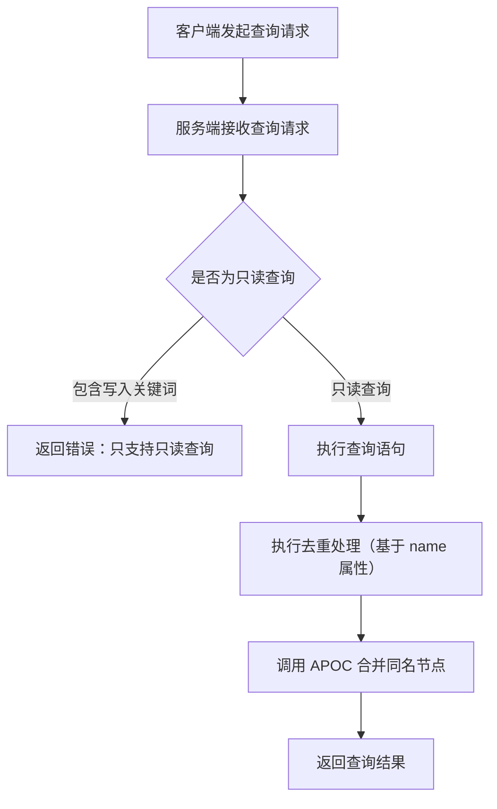
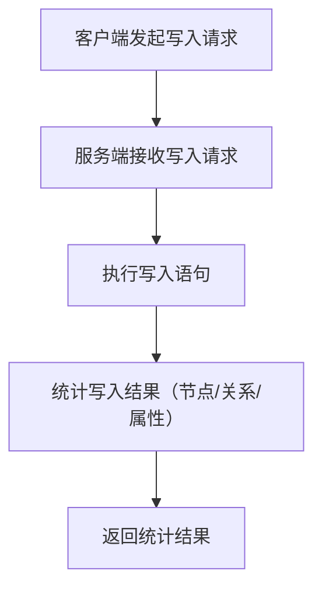

# Neo4j 模块流程图

下面给出 Neo4j 工具的两个核心流程：查询流程和写入流程。

## 查询流程（read-neo4j-cypher）

说明：
- 查询流程会在读取后做去重，基于 `name` 属性合并节点（依赖 APOC）。
- 工具入口在 `mcp/server/neo4j/src/main/java/mcp/canary/neo4j/tool/Neo4jMCPTool.java`。

## 写入流程（write-neo4j-cypher）

说明：
- 写入流程不依赖 APOC。
- 结果返回写入统计信息，便于前端展示写入结果。
