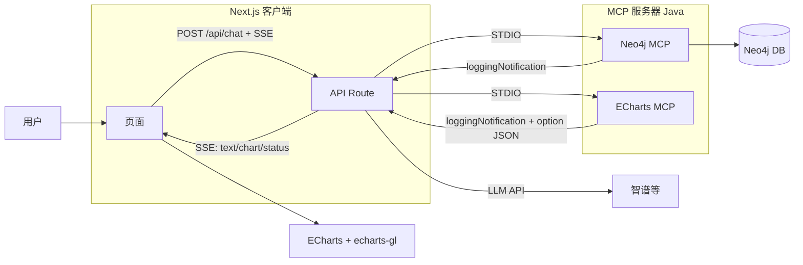

# AI-Yunxun 总体系统设计

## 1. 概述

本项目由三个核心模块组成：**Neo4j MCP Server**、**ECharts MCP Server**、**Next.js 客户端**。两个 MCP 服务器以 Java 实现，通过 STDIO 与 MCP 客户端通信；客户端仅保留 Next.js 单层（前端 + API Route），通过 SSE 接收 MCP 相关通知做效果展示，开发重心放在 MCP 服务器的完善与扩展。

---

## 2. 三个模块的职责与配合

### 2.1 模块职责

| 模块 | 职责 |
|------|------|
| **Neo4j MCP Server** | 提供 Neo4j 图数据库的 schema 查询与 Cypher 读写能力（get-neo4j-schema、read-neo4j-cypher、write-neo4j-cypher），供大模型在对话中调用。 |
| **ECharts MCP Server** | 提供关系图（graph）与 GL 关系图（graphGL）的生成（generate_graph_chart、generate_graph_gl_chart），支持 **outputType**：option（ECharts option JSON）、png、svg（服务端渲染为图像）。返回 option 时由前端 ECharts + echarts-gl 渲染；返回 png/svg 时可**直接嵌入大模型回复**或前端用 `` 展示，降低前端开发量。详见 [echart-mcp-server-architecture.md](echart-mcp-server-architecture.md)。 |
| **Next.js 客户端** | 提供对话 UI、工具状态/日志展示、关系图与 GL 关系图展示；API Route 负责调用 LLM、通过 Node MCP SDK 调用两个 Java MCP 服务器（STDIO），并通过 SSE 推送流式文本与 MCP 通知（chart：option 或 image）。并暴露 **图谱工具直接调用接口**（如 POST /api/tools/echart/graph、/graph-gl），前端可不经大模型、手捏请求展示图谱。详见 [nextjs-client-architecture.md](nextjs-client-architecture.md)。 |

### 2.2 配合关系

- **用户** 在前端输入消息 → **Next.js 页面** POST `/api/chat` 并建立 SSE 连接。
- **API Route** 调用 **LLM** 流式对话；若 LLM 返回 **tool_calls**，则通过 **Node MCP SDK** 以 **STDIO** 调用 **Neo4j MCP** 或 **ECharts MCP**。
- **Neo4j MCP** 执行 Cypher 并返回结果；**ECharts MCP** 返回 ECharts option JSON。API Route 将工具结果喂回 LLM 或直接通过 SSE 的 `chart` 事件推给前端。
- **MCP 服务器** 在执行过程中通过 MCP **loggingNotification** 发送日志；API Route 可收集并随 SSE 的 `tool_log` 等推给前端，用于“调用中/成功/失败”与日志面板。
- **前端** 根据 SSE 事件更新消息、状态、日志；`chart` 事件可为 **option**（ECharts 渲染）或 **image**（base64 PNG/SVG，用 `` 展示），便于大模型返回中直接嵌入图像。前端也可直接 POST `/api/tools/echart/graph` 或 `/graph-gl` 传入 data 展示图谱，无需经过大模型。

### 2.3 数据流小结

1. 用户输入 → 前端 POST `/api/chat`（conversationId + message），建立 SSE。
2. API Route：LLM 流式对话 → 若返回 tool_calls → 调用 Neo4j/ECharts MCP（STDIO）→ 将结果喂回 LLM 或推 chart。
3. 前端：SSE 的 `text` 追加到消息，`chart` 交给 ECharts 渲染，`status`/`tool_log` 更新状态与日志。
4. 不依赖 Java 客户端后端，不引入 WebSocket；MCP 相关通知均通过 SSE 传递，以效果展示为主。

---

## 3. 项目其他依赖项

### 3.1 开发与运行环境

| 依赖项 | 版本/说明 |
|--------|------------|
| **Java** | 17（MCP 服务器为 Spring Boot 3.x，需 JDK 17+） |
| **Node.js** | v22（Next.js 客户端开发与运行；建议 LTS 或 v22） |
| **Neo4j** | 需单独部署（如 Docker），供 Neo4j MCP Server 连接；若使用 get-neo4j-schema，需安装 **APOC** 插件 |
| **Maven** | 用于构建两个 Java MCP 服务器（mcp/server/neo4j、mcp/server/echart） |

### 3.2 可选/外部依赖

| 依赖项 | 说明 |
|--------|------|
| **智谱 / OpenAI 兼容 API** | Next.js API Route 调用 LLM 时使用；API Key 等通过环境变量配置 |
| **ECharts + echarts-gl** | 仅在前端 Next.js 中引入，用于渲染关系图与 GL 关系图；MCP 服务器不依赖 |

### 3.3 项目目录与文档索引

- **mcp/server/neo4j**：Neo4j MCP Server，详见 [neo4j-mcp-server-architecture.md](neo4j-mcp-server-architecture.md)。
- **mcp/server/echart**：ECharts MCP Server，详见 [echart-mcp-server-architecture.md](echart-mcp-server-architecture.md)。
- **mcp/client-next**（或新建 Next.js 项目）：Next.js 客户端，详见 [nextjs-client-architecture.md](nextjs-client-architecture.md)。
- **doc/system-design.md**：本文档，总体系统设计与依赖说明。

---

## 4. 部署与运行注意

- **Neo4j MCP Server**：需先启动 Neo4j 实例并配置 URI/用户名/密码；若使用 get-neo4j-schema，需安装 APOC。
- **ECharts MCP Server**：无外部数据库依赖，以 MCP STDIO 模式运行，由 Next.js API Route 启动子进程。
- **Next.js 客户端**：API Route 通过 MCP SDK 以 STDIO 启动 Java MCP 进程，需确保运行环境允许 **子进程**（如自托管 Node）；若部署到 Vercel 等无子进程环境，需改为远程 MCP 或仅在本地运行。
- **Java 客户端**（mcp/client，Spring Boot + Spring AI）：新方案下不再使用，可保留作参考或移除。
