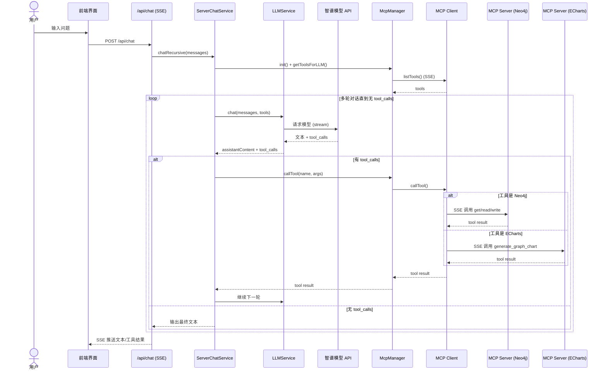

# 时序图

下面的时序图基于当前实现的调用链路，体现“模型 -> 工具 -> 模型”的串行流程。

```mermaid
sequenceDiagram
    actor User as 用户
    participant UI as 前端界面
    participant API as /api/chat (SSE)
    participant Chat as ServerChatService
    participant LLM as LLMService
    participant Zhipu as 智谱模型 API
    participant MCP as McpManager
    participant Client as MCP Client
    participant Neo4j as MCP Server (Neo4j)
    participant EChart as MCP Server (ECharts)

    User->>UI: 输入问题
    UI->>API: POST /api/chat
    API->>Chat: chatRecursive(messages)
    Chat->>MCP: init() + getToolsForLLM()
    MCP->>Client: listTools() (SSE)
    Client-->>MCP: tools

    loop 多轮对话直到无 tool_calls
        Chat->>LLM: chat(messages, tools)
        LLM->>Zhipu: 请求模型 (stream)
        Zhipu-->>LLM: 文本 + tool_calls
        LLM-->>Chat: assistantContent + tool_calls
        alt 有 tool_calls
            Chat->>MCP: callTool(name, args)
            MCP->>Client: callTool()
            alt 工具是 Neo4j
                Client->>Neo4j: SSE 调用 get/read/write
                Neo4j-->>Client: tool result
            else 工具是 ECharts
                Client->>EChart: SSE 调用 generate_graph_chart
                EChart-->>Client: tool result
            end
            Client-->>MCP: tool result
            MCP-->>Chat: tool result
            Chat->>LLM: 继续下一轮
        else 无 tool_calls
            Chat-->>API: 输出最终文本
        end
    end

    API-->>UI: SSE 推送文本/工具结果
```
